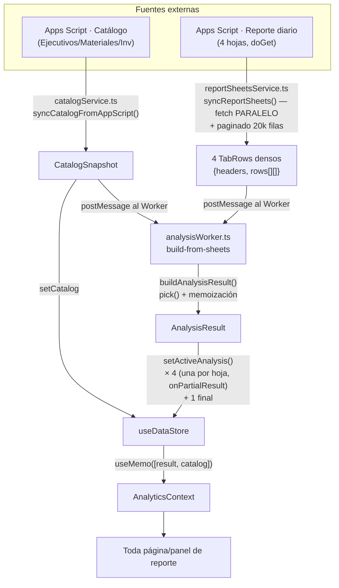
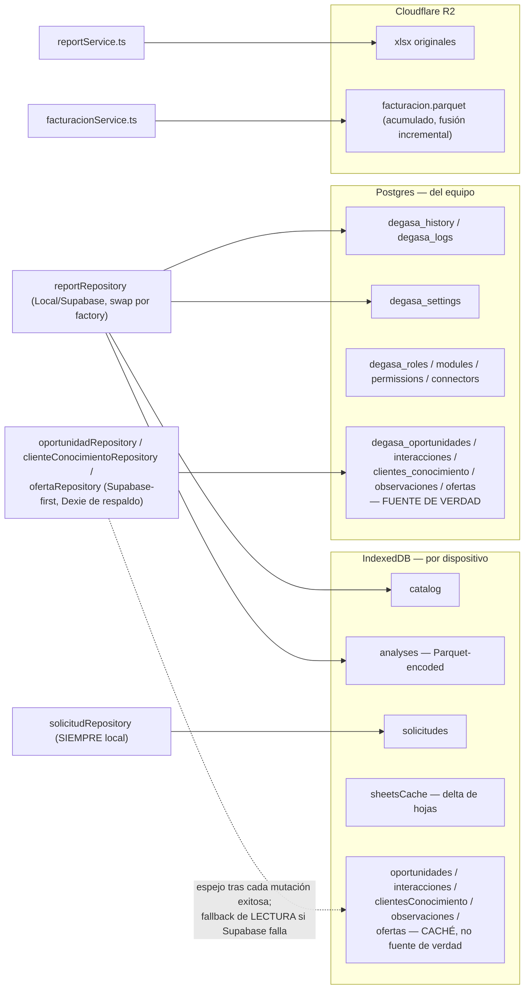
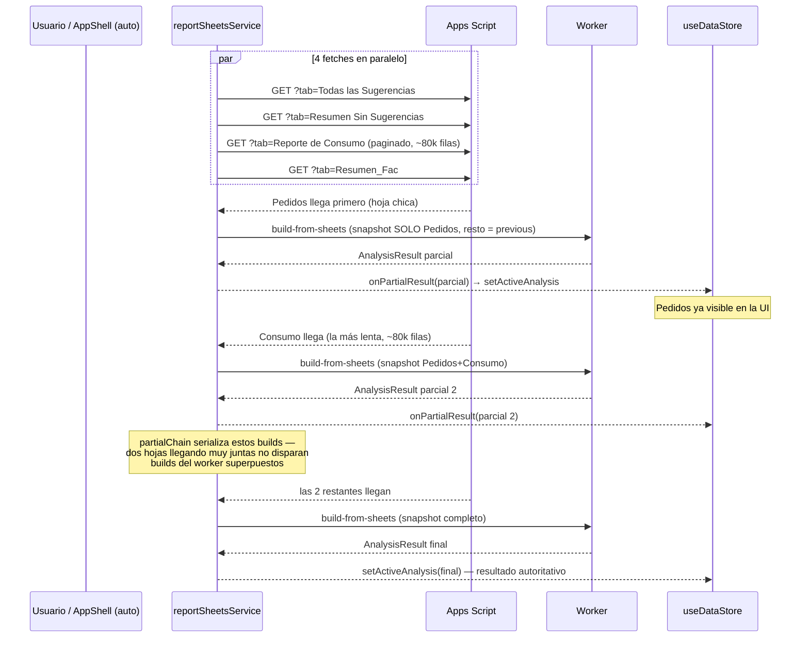
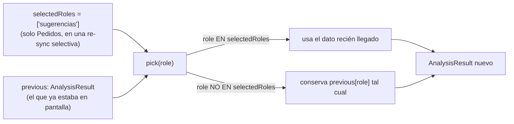
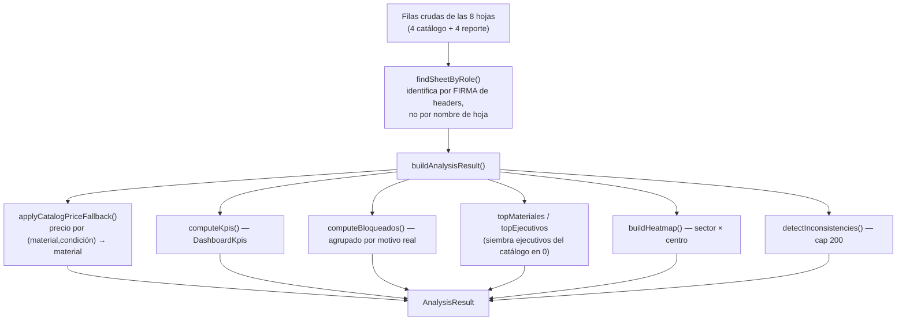

# DataFlow.md — De Google Sheets/Supabase a la UI

> Parte de la serie de documentación técnica. Este documento traza el **flujo de datos**; `SequenceDiagrams.md` traza el **flujo de eventos** (qué dispara qué función, en orden).

## 1. Las dos fuentes y el cruce

## 2. Persistencia — quién escribe dónde

**Regla que vale la pena memorizar:** hay **dos filosofías de persistencia distintas conviviendo a propósito** —
- Solicitudes DRP: **local-only**, sin Supabase — es información por dispositivo, no del equipo.
- Conocimiento de Oportunidades (ficha de cliente, ofertas, oportunidades): **Supabase-first** — es del equipo, Dexie es solo caché para que la bandeja no se quede en blanco offline.

## 3. Sincronización progresiva (por qué "Pedidos" puede aparecer antes que "Consumo")

Esto corre tanto en la sync manual (botón "Sincronizar ahora" en Carga) como en el chequeo automático de `AppShell` al abrir/enfocar la pestaña (conectado en esta misma sesión de trabajo — antes solo la sync manual tenía `onPartialResult`).

## 4. `pick()` — por qué una sync parcial nunca borra datos

Aplica tanto a las 4 hojas del reporte diario como a las superficies derivadas memoizadas (KPIs, heatmap) — si ninguna hoja que las alimenta cambió, se reutiliza el valor de `previous` sin recalcular.

## 5. El cruce catálogo + reporte (dentro del Worker)

## 6. Derivados calculados en caliente (nunca persistidos)

Estos NO viven en `AnalysisResult` ni en ningún store — se recalculan cada vez que se necesitan, sobre datos ya cargados:

| Derivado | Función | Usado por |
|---|---|---|
| `BOItem[]` (deduplicación de pedidos) | `core/buildBO.ts` | Pedidos, Hoy, paneles `sugDetalle`/`pedido` |
| `RFIndex` (series mensuales) | `core/resumenFac.ts` | Análisis, ABC, scoring de Oportunidades |
| `RSSIndex` (pivote material×centro) | `core/resumenSin.ts` | Inventario |
| `AbcResult` (clasificación 80/20) | `core/abc.ts` | Consumo, Sugerencias, scoring |
| `PrecioDispersionEntry[]` | `core/precios.ts` | Consumo |
| `ScoreResult[]` (compatibilidad cliente↔material) | `core/scoring.ts` | Compatibilidad (Oportunidades) — **nunca se persiste el score**, solo la decisión final (Oportunidad/Oferta) |
| `OportunidadCandidata[]` | `core/oportunidad.ts` | Bandeja de Oportunidades (sugerencias antes de "Crear") |
