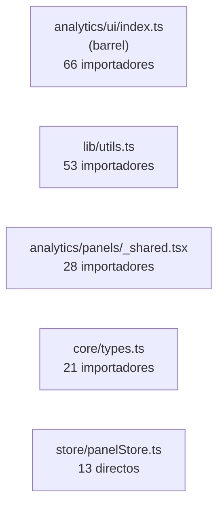

# DependencyGraph.md — Quién importa a quién

> Parte de la serie de documentación técnica. Datos obtenidos por grep real sobre el árbol `src/` (no estimados) el 2026-08-07. Total del repo: **19,090 líneas** en `.ts`/`.tsx`.

## 1. Los 5 hubs reales de la app (por # de importadores)

### `analytics/ui/index.ts` — 66 importadores (el hub más grande)
Barrel de componentes reutilizables (`DebouncedSearch`, `StatTile`, `Chip`, `StatePill`, `TrendBadge`, `AbcBadge`, `EvolChart`, `ColumnFilterBar`, `ColumnVisibilityControl`/`ColumnChecklist`, `SavedViewsControl`, `RowContextMenu`, `Ranking`, `ZoomControl`, `DetailChevron`…). Importado por: los 13 paneles de `analytics/panels/`, las ~11 páginas de reporte, los ~10 componentes/paneles de Oportunidades, `Sidebar`/`Topbar`/`CommandPalette`, y sus propios miembros re-importándose entre sí.

**Riesgo:** es el archivo con mayor "blast radius" del repo — un cambio de firma en cualquier export rompe potencialmente 66 archivos. Contrapartida: es solo un barrel (`export { X } from './X'`), así que el riesgo real vive en cada componente individual, no en el barrel mismo.

### `lib/utils.ts` — 53 importadores
Formateo (`formatCurrency`, `formatNumber`, `formatFechaCaducidad`, `formatDateTime`), `cn()` (merge de clases Tailwind). Transversal a página de reporte, panel, componente de Oportunidades y varios `components/ui/*`.

### `analytics/panels/_shared.tsx` — 28 importadores
`SugTable`, `ConsumoTable`, `ClienteConsumoTable`, `LotesTable`, `FuentesTable`, `PrecioCondicionBox`, `Section`, `SubFilter`. Consumido por los 13 paneles + `columns.ts` (Sugerencias/Consumo) + `SettingsPage.tsx`.

### `core/types.ts` — 21 importadores
El contrato de datos compartido — toca repos, servicios, stores, workers y `lib/`. Es también el archivo más grande de `core/` (516 líneas) porque concentra TODOS los tipos de dominio, incluyendo los 5 tipos nuevos del módulo Oportunidades (`Oportunidad`, `Interaccion`, `ClienteConocimiento`, `Observacion`, `Oferta`).

### `store/panelStore.ts` — 13 importadores directos (+ acoplamiento indirecto vía `PanelHost`)
Nota importante de arquitectura: los paneles de `analytics/panels/*` **no** importan `useAnalytics()` directamente — reciben `a: Analytics` como prop desde `PanelHost`. Su dependencia real con `AnalyticsContext` es indirecta a través de `PanelHost`, que sí la importa (11 importadores directos: todas las páginas de reporte + `MaterialHubPanel` + `MaterialSearch`).

## 2. Otros hubs de dominio

| Archivo | # importadores | Alcance |
|---|---|---|
| `store/dataStore.ts` | 13 | Dashboard, Hoy, Consumo, Sugerencias, Inventario, ResumenSin, Análisis, Comodato, Results, AppShell, Topbar, Upload, Settings, `AnalyticsContext` |
| `store/conocimientoStore.ts` | 13 | 100% concentrado en `modules/oportunidades/` + sus repositorios + `db.ts`. Único punto de fuga: `ClienteDetallePanel.tsx` (fuera de Oportunidades) empuja al panel `clienteConocimiento` — acoplamiento cruzado deliberado ("Ver ficha comercial" desde Consumo) |
| `repositories/index.ts` | 10 | Settings, AppShell, conocimientoStore, reportSheetsService, catalogService, solicitudService, reportService, solicitudStore, logError, HistoryPage |
| `store/permissionsStore.ts` | 9 | SettingsPage, MaterialHubPanel, `_shared.tsx`, SugerenciasPage, Sidebar, OportunidadListView, SugDetallePanel, ModuleGuard, useAuth |

## 3. Dependencias circulares

`grep -rn "from '@/modules\|from '@/store" src/core/` → **vacío**. `core/` (dominio puro) no importa nada de `modules/` ni `store/` — la regla arquitectónica de `Architecture.md` §3 se cumple, sin dependencias circulares detectadas en ese sentido. No se auditaron ciclos dentro de `modules/` mismo (ej. A importa de B que importa de A) — pendiente si se necesita esa garantía específica.

## 4. Código potencialmente muerto

Tras verificar cada candidato de un escaneo automático con grep dirigido (el escaneo automático dio varios falsos positivos por nombre poco común, no por estar sin usar):

- **`src/hooks/useSearchIndex.ts`** — `useSearchIndex<T>(...)` **no tiene ningún importador** en todo el repo. Candidato real a código muerto o a una utilidad escrita para un caso que luego se resolvió distinto (posiblemente predecesor de `searchNorm`/`matchesQueryNormalized` en `analytics/helpers.ts`, que sí se usa ampliamente).
- Falsos positivos descartados tras verificación: `useKeybindings.test.ts`, `confirm-dialog.tsx`, `GlobalKeybindings.tsx`, `CheatsheetDialog.tsx`, `r2Service.ts`, `reportApiHealth.ts`, `comodatoService.ts` — todos tienen exactamente 1 importador legítimo (componentes de shell/servicios de un solo punto de uso, no muertos).

No se encontraron páginas, componentes ni servicios adicionales sin importar en ningún lado.

## 5. Archivos más grandes (top 20 por líneas)

| Líneas | Archivo |
|---|---|
| 787 | `modules/sugerencias/SugerenciasPage.tsx` |
| 560 | `modules/consumo/ConsumoPage.tsx` |
| 516 | `core/types.ts` |
| 497 | `services/reportSheetsService.ts` |
| 455 | `core/resumenFac.ts` |
| 425 | `modules/admin/AdminPage.tsx` |
| 418 | `modules/analisis/AnalisisPage.tsx` |
| 408 | `modules/inventario/InventarioPage.tsx` |
| 356 | `modules/analytics/panels/_shared.tsx` |
| 314 | `modules/resumenSin/ResumenSinPage.tsx` |
| 289 | `core/mappers.ts` |
| 288 | `core/analysis.ts` |
| 284 | `modules/results/ResultsPage.tsx` |
| 283 | `modules/dashboard/DashboardPage.tsx` |
| 281 | `core/scoring.ts` |
| 242 | `modules/oportunidades/panels/MaterialHubPanel.tsx` |
| 222 | `services/solicitudService.ts` |
| 217 | `workers/analysisWorker.ts` |
| 211 | `modules/upload/UploadPage.tsx` |
| 209 | `store/conocimientoStore.ts` |

`SugerenciasPage.tsx` (787 líneas) y `ConsumoPage.tsx` (560) son los dos candidatos más claros a partirse en subcomponentes — ver `TechnicalDebt.md` §1 e `ImprovementRoadmap.md`.

## 6. Complejidad condicional (switch / else-if)

**Switch:** solo `repositories/index.ts` tiene switches con volumen (9 `case` en total, repartidos en 9 factories `create*Repository(backend)` — uno por entidad, cada uno con 2 ramas `'local'|'supabase'`). Ningún switch gigante de lógica de negocio en el repo.

**Else-if encadenado:** máximo 2 ramas en cualquier archivo (`analysisWorker.ts`, `ConsumoPage.tsx`, `CommandPalette.tsx`, `SolicitarDialog.tsx`, `buildBO.ts`) — nada preocupante.

## 7. Duplicación de patrones verificada

- **Tablas de consumo por cliente:** una sola implementación (`_shared.tsx`), sin reimplementaciones paralelas — confirmado.
- **Debounce:** el único patrón de debounce de texto de búsqueda es `useDebouncedValue`/`DebouncedSearch`; los 8 usos sueltos de `setTimeout` en el repo son para otras cosas (auto-dismiss de toast, hover-intent del sidebar, reset de "copiado"/"guardado", focus de input) — no duplican el concepto.
- **`localStorage` directo fuera de los hooks conocidos (`useColumnVisibility`/`useSavedViews`/`useZoom`):** 2 casos, ambos legítimos y de propósito distinto — `InventarioPage.tsx` (modo admin local, claves `inv_admin`/`inv_hidden`) y `reportSheetsService.ts` (throttle de chequeo automático, clave `report-sheets-sync-meta`).

## 8. Marcadores de deuda técnica

`grep -rn "TODO\|FIXME\|XXX\|@deprecated" src/` → **cero resultados en todo el repo**. No hay marcadores explícitos de trabajo pendiente en el código — la deuda real (ver `TechnicalDebt.md`) no está señalizada así; vive en el código mismo (archivos grandes, patrones repetidos, decisiones documentadas como "por ahora" en comentarios largos sin la palabra TODO).
