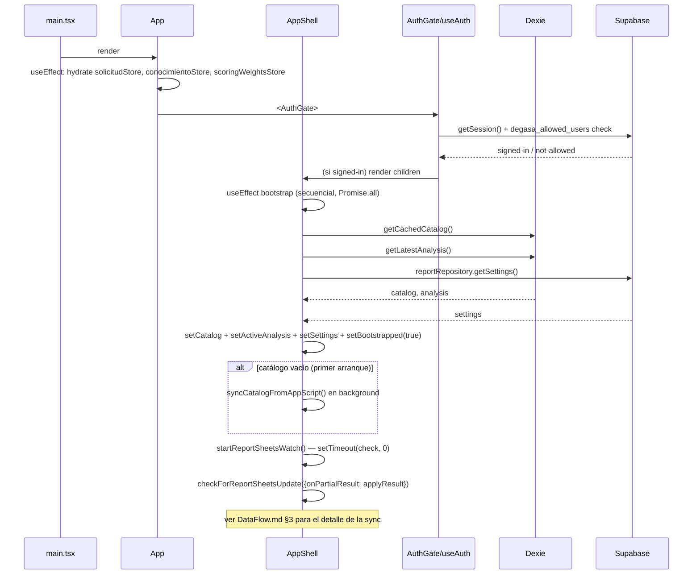
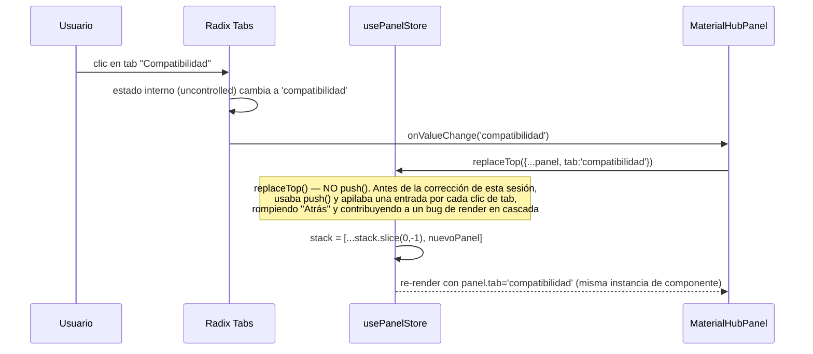
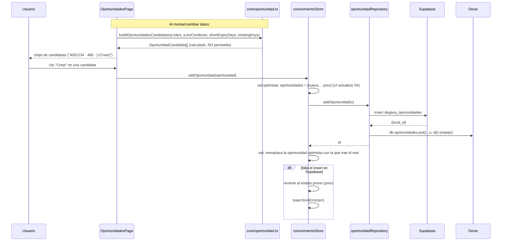
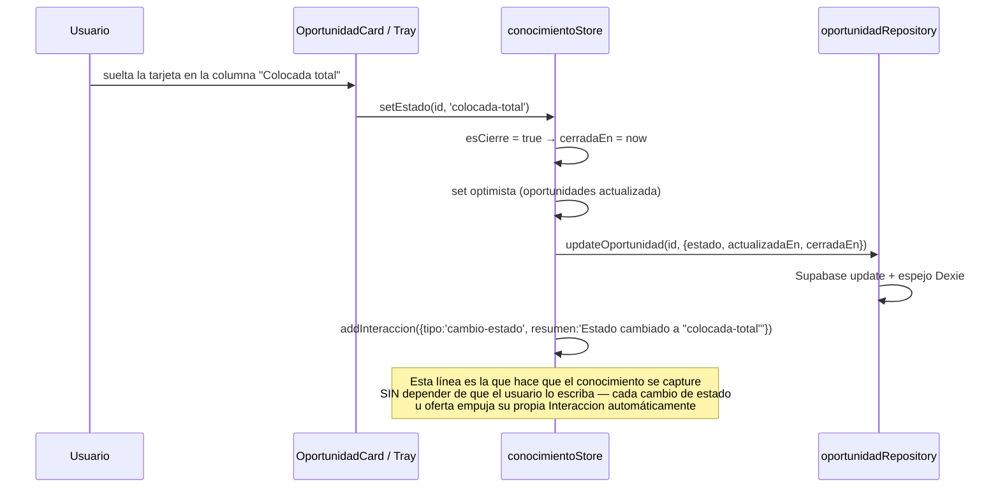
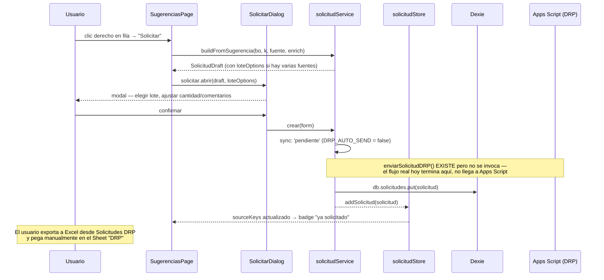

# SequenceDiagrams.md — Flujos de interacción clave

> Parte de la serie de documentación técnica. Cada diagrama responde "¿qué pasa exactamente cuando hago clic aquí?" para una acción concreta.

## 1. Arranque de la app (bootstrap)



## 2. Clic en un material (abre el panel `material`)

```mermaid
sequenceDiagram
    participant U as Usuario
    participant Chip
    participant PS as usePanelStore
    participant PH as PanelHost
    participant MP as MaterialPanel

    U->>Chip: clic en <Chip>{material}</Chip>
    Chip->>PS: push({type:'material', material}) o open(...)
    PS->>PS: stack = [...stack, panel]  (nueva referencia)
    PS-->>PH: notifica (suscrito a stack)
    PH->>PH: panel = stack[stack.length-1]
    PH->>MP: <PanelBody panel={panel} a={a} push={push} />
    MP->>MP: lotesF = lotes.filter(...) — POR MATERIAL, sin memo en este panel legacy
    MP->>MP: sug = sugFor(bo, material); cons = consFor(consumo, material)
    MP-->>U: Sheet abre desde la derecha, tabs Sugerencias/Consumo
    U->>MP: clic en tab "Consumo"
    MP->>MP: <ConsumoTable list={cons} a={a} push={push} />
    Note over MP: SugTable/ConsumoTable ahora leen useColumnVisibility('sugerencias_columnas'/'consumo_columnas')<br/>— mismas columnas que la página completa (cambio de esta sesión)
```

## 3. Cambiar de pestaña dentro de un panel con tabs (materialHub / clienteConocimiento)



## 4. Crear una Oportunidad desde una candidata sugerida



## 5. Cambiar el estado de una Oportunidad (drag&drop o Select) — y el registro automático de conocimiento



## 6. Generar una Solicitud DRP desde Pedidos



## 7. Registrar una oferta y su resultado (scoring en acción)

```mermaid
sequenceDiagram
    participant U as Usuario
    participant MHP as MaterialHubPanel (tab Compatibilidad)
    participant Score as core/scoring.ts
    participant CCP as ClienteConocimientoPanel (tab Ofertas)
    participant CS as conocimientoStore

    Note over MHP,Score: Al abrir la pestaña Compatibilidad:
    MHP->>Score: rankClientes(material, {consumo, rf, bo, abc, condicion,<br/>diasVigencia, precioOferta, precioLista, clientesByDest, ofertas, pesos})
    loop por cada cliente candidato
        Score->>Score: scoreCliente() — 10 criterios, cada uno fracción×peso
    end
    Score-->>MHP: ScoreResult[] ordenado, con bloqueantes separados
    MHP-->>U: lista "Aceptados" + "Descartados (razón visible)"

    U->>MHP: clic "Ofertar" en un cliente
    MHP->>CCP: push({type:'clienteConocimiento', tab:'ofertas', prefillMaterial})
    U->>CCP: completa cantidad/precio, "Registrar oferta"
    CCP->>CS: addOferta(oferta)
    CS->>CS: Supabase insert + Dexie espejo + addInteraccion(tipo:'oferta')
    CS->>CS: clientesByDest se RECALCULA completo (deriveMetrics: tasaAceptacion, tiempoRespuestaProm)

    Note over U: Días después — el usuario marca el resultado:
    U->>CCP: clic "Rechazó" + motivo
    CCP->>CS: registrarResultado(id, {resultado:'rechazada', motivoRechazo})
    CS->>CS: addInteraccion(...) — timeline se actualiza solo
    Note over Score: La PRÓXIMA vez que se abra Compatibilidad para este material,<br/>el criterio "rechazo-reciente" verá esta oferta y penalizará -15<br/>si es &lt;30 días — el ranking cambia SIN tocar código
```

## 8. Error boundary y recuperación

```mermaid
sequenceDiagram
    participant Comp as Cualquier componente
    participant EB as ErrorBoundary (global, App.tsx)
    participant U as Usuario

    Comp->>Comp: throw (render error, ej. acceso a propiedad de undefined)
    Comp-->>EB: React propaga el error al boundary más cercano
    EB->>EB: getDerivedStateFromError → state.error = err
    EB->>EB: componentDidCatch → console.error(err, componentStack)
    EB-->>U: "Ocurrió un error al mostrar esta vista" + botón Reintentar
    Note over EB: Hay UN SOLO ErrorBoundary global (sin resetKey) en App.tsx.<br/>AppShell también envuelve el &lt;Outlet/&gt; en su PROPIO ErrorBoundary<br/>con resetKey={location.pathname} — ese sí se auto-limpia al navegar.
    U->>EB: clic "Reintentar"
    EB->>EB: setState({error:null})
    EB-->>Comp: vuelve a intentar el render
```
