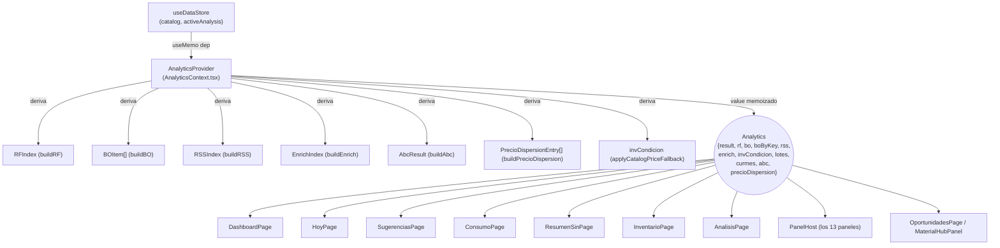
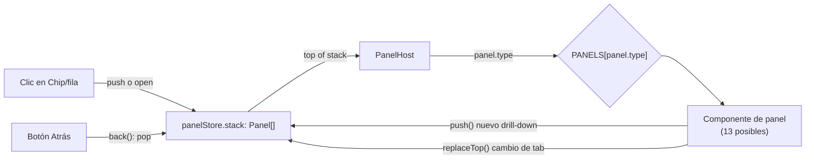
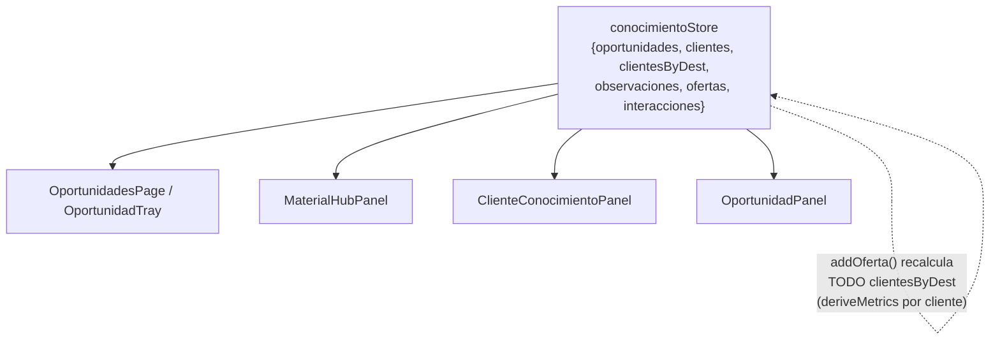
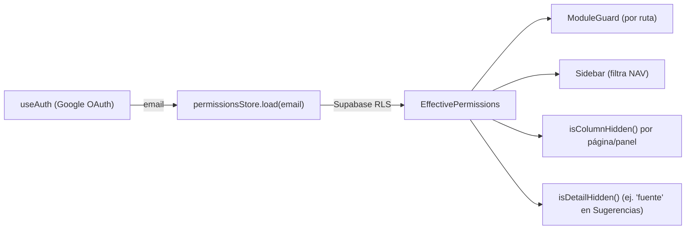

# StateFlow.md — Estado, Contexts y qué re-renderiza qué

> Parte de la serie de documentación técnica. Complementa `DataFlow.md` (de dónde viene el dato) con "qué se dispara en memoria cuando ese dato cambia".

## 1. Inventario de stores (Zustand, todos independientes — no hay un store raíz)

| Store | Archivo | Contenido | Persistencia |
|---|---|---|---|
| `useDataStore` | `store/dataStore.ts` | `catalog`, `activeAnalysis`, `settings`, `bootstrapped` | Dexie + Supabase (settings) |
| `usePanelStore` | `store/panelStore.ts` | `stack: Panel[]` (pila de drill-down) | En memoria, se pierde al recargar (intencional) |
| `useConocimientoStore` | `store/conocimientoStore.ts` | `oportunidades`, `clientes`, `clientesByDest`, `observaciones`, `ofertas`, `interacciones` | Supabase + Dexie (caché) |
| `useScoringWeightsStore` | `store/scoringWeightsStore.ts` | `pesos` (overrides del motor de compatibilidad) | Supabase (`degasa_connectors`) |
| `usePermissionsStore` | `store/permissionsStore.ts` | `perms` (efectivos por rol/usuario) | Supabase, cargado una vez al login |
| `useSolicitudStore` | `store/solicitudStore.ts` | `list`, `sourceKeys` (Set, para badge O(1)) | Dexie, 100% local |
| `useUiStore` | `store/uiStore.ts` | tema, sidebar colapsado, último path visitado | localStorage |
| `useReportSheetsSyncStore` | `store/reportSheetsSyncStore.ts` | `syncing`, `progress`, `error` (de la sync en vivo) | En memoria |
| `useToastStore` | `store/toastStore.ts` | cola de toasts | En memoria |
| `useCommandPaletteStore` | `store/commandPaletteStore.ts` | abierto/cerrado del Ctrl+K | En memoria |

## 2. El único React Context real: `AnalyticsContext`

**Punto crítico de rendimiento:** el `value` de `AnalyticsProvider` está memoizado con `useMemo(..., [result, catalog])` — así que **cualquier cambio de `activeAnalysis` o `catalog` recalcula TODOS los índices derivados y fuerza un re-render de TODO módulo que llame `useAnalytics()`**, sin importar si ese módulo usa `rf` o `rss` o ninguno de los dos. No hay selectores granulares (`useAnalyticsSelector((a) => a.rf)`) — es "todo o nada". Ver `TechnicalDebt.md` para el impacto medido.

## 3. `usePanelStore` — la pila de drill-down

`push()` apila (drill-down real, "Atrás" debe volver); `replaceTop()` reemplaza el tope (cambio de pestaña dentro del mismo panel — confundir ambos fue la causa de un bug real de renders en cascada, ver `TechnicalDebt.md`). Solo `PanelHost` se suscribe a `stack`; cada panel individual solo re-renderiza cuando SU propio `panel` (objeto en el tope) cambia de referencia.

## 4. `useConocimientoStore` — el más propenso a selectores inestables

`clientesByDest` se recomputa por completo (`byDest(clientes, ofertas)`) en cada `upsertCliente`/`addOferta`/`registrarResultado` — barato hoy (decenas de clientes con ficha), pero es O(clientes × ofertas) y crecería mal si el CRM llega a miles de fichas. Cualquier componente que lea `s.observaciones.filter(...)`/`s.interacciones.filter(...)` **inline en el selector** (sin `useMemo`) recibe un array nuevo en cada notificación del store, aunque el dato relevante no haya cambiado — corregido en el módulo Oportunidades esta sesión (`useMemo` explícito en `NotasMaterial`, `ObservacionesList`, `Timeline`, `OportunidadPanel`, `ClienteConocimientoPanel`); **no verificado fuera de ese módulo** — ver `DependencyGraph.md`/`TechnicalDebt.md` para el resto del código.

## 5. Permisos — cómo se propagan las restricciones

`isColumnHidden`/`isDetailHidden` se llaman **de nuevo en cada componente que las necesita** (página completa Y panel) — no hay un contexto de "columnas efectivas ya resueltas"; cada `SugTable`/`ConsumoTable`/`SugerenciasPage` vuelve a consultar `usePermissionsStore` y recomputar. Correcto pero repetitivo.

## 6. Qué NO usa Context — patrón deliberado

`usePanelStore`, `useConocimientoStore`, etc. son Zustand hooks, no Context — cada componente que llama `useXStore(selector)` se suscribe solo a lo que selecciona (si el selector es estable). La única razón de que `AnalyticsContext` sea un Context de React (no otro store Zustand) es que sus valores son **derivados** de `useDataStore`, no estado propio — el patrón correcto sería quizás un store Zustand con un selector memoizado en vez de Context + useMemo, pero no cambia el problema de fondo (§2).
